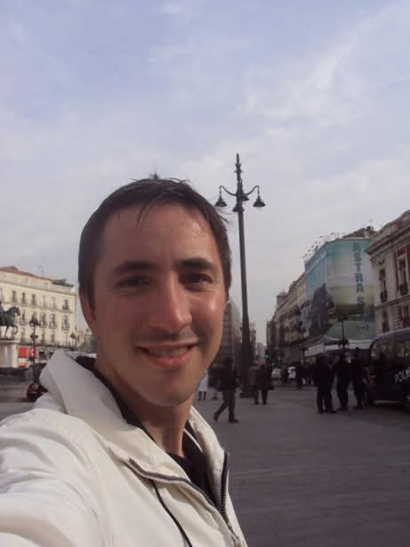

# Marco Aurélio Aloise Filho

<!-- Selector de Idiomas / Language Switcher -->

  <b>🌐 Idiomas / Languages:</b> 
  <a href="README.md">🇺🇸 English</a> &nbsp;|&nbsp;
  <a href="README.pt.md">🇧🇷 Português</a> &nbsp;|&nbsp;
  <a href="README.it.md">🇮🇹 Italiano</a> &nbsp;|&nbsp;
  <b>🇪🇸 Español</b> &nbsp;|&nbsp;
  <a href="README.he.md">🇮🇱 עברית</a>

<!-- Foto de Perfil - Versión en Español -->

### Ingeniero de Software &bull; Investigador en Inteligencia Artificial &bull; Una década de experiencia docente universitaria

---

## 📌 Sobre Mí & Trayectoria

Soy graduado en Informática (FATEC-ZL) con más de dos décadas de trayectoria en el campo tecnológico, combinando la práctica diaria en desarrollo de software con la investigación y la docencia. Cuento con un **MBA en Ingeniería de Software por la Universidad de São Paulo (USP / Esalq)**, una **Especialización en Ingeniería de Software por la Universidad Estatal de Campinas (UNICAMP)** y un curso de **Extensión en Arquitectura de Software, Componentización y SOA también por la UNICAMP**.

Me desempeño como Analista de Sistemas Senior en el CRCSP, donde ideé e implementé el ecosistema de apoyo al análisis de procesos con Inteligencia Artificial — aplicando redes neuronales profundas (MLP), modelos Transformer para la predicción de resoluciones procesales y dosimetría de sanciones, así como modelos de lenguaje locales (**Gemma** mediante LlamaSharp). En el ámbito universitario, cuento con una década de experiencia docente en la Universidad de Mogi das Cruzes (UMC, 2011–2022), impartiendo materias fundamentales de computación (Algoritmos, Estructuras de Datos, Programación Orientada a Objetos y Arquitectura de Software), actuando en la dirección de tesis de grado (TCC) y formando parte de tribunales examinadores.

Este perfil en GitHub es una breve presentación personal y de algunos de mis proyectos de autoría propia.

---

## 🔬 Líneas de Investigación & Enfoque Científico

Mi trabajo de investigación busca articular la fundamentación teórica con la solución de problemas prácticos en entornos reales:

* **Inteligencia Artificial Aplicada & Redes Neuronales Profundas:** Exploración de arquitecturas modernas (Transformers, GANs, LSTMs y MLPs) para análisis predictivo, series de tiempo complejas y generación de datos sintéticos (*data augmentation*) para robustecer muestras reducidas.
* **Integración Hardware-Software & Telemetría Industrial (IoT):** Captura continua de variables de procesos en tiempo real mediante protocolos industriales (Modbus/TCP) y ejecución acelerada de modelos en el borde (*edge*) sobre GPU y NPU (vía DirectML).
* **Ingeniería de Software & Ingeniería Inversa (Herramientas CASE):** Desarrollo de analizadores sintácticos (parsers AST), motores de análisis de código y reconstrucción automática de diagramas arquitectónicos a partir de código fuente políglota.
* **Algoritmos & Computación de Alto Rendimiento:** Modernización y optimización de algoritmos clásicos de compresión y procesamiento de datos para plataformas de 64 bits en C++ y C#.

---

## 🏆 Distinciones Académicas

* **Nominación a Mejor Tesis de Maestría/MBA (USP / Esalq, 2026):** Trabajo de graduación titulado *"Uso de Machine Learning para correlacionar variables del tueste de cafés especiales con notas sensoriales"*, aprobado con calificación máxima y propuesto para distinción por los profesores Elisa Antolli (directora) y Diego Raphael Amancio (jurado evaluador USP). El resumen ejecutivo de la investigación fue publicado en la revista *Revista E&S (Pecege)* y se encuentra disponible en: [Machine Learning en el tueste y análisis sensorial de cafés especiales](https://revistaes.com.br/resumo-executivo/machine-learning-na-torra-e-analise-sensorial-de-cafes-especiais).

---

## 💻 Grandes Proyectos de Software

> *Nota:* Todos mis proyectos principales se conservan en repositorios privados por tratarse de desarrollos de autor e investigación en curso. He dispuesto repositorios públicos de presentación (*overview*) con documentación arquitectónica y muestras técnicas. **El acceso al código fuente completo de los repositorios privados puede otorgarse previa solicitud.**

<table>
  <tr>
    <td width="35%" align="center">
      
    </td>
    <td width="65%" valign="top">
      <h3>☕ <a href="https://github.com/mjcg12/venezia-overview">Proyecto Venezia</a></h3>
      
<b>Investigación Aplicada &bull; IoT Industrial &bull; Machine Learning &bull; Data Augmentation</b>

      

        Plataforma integral de telemetría industrial que adquiere en tiempo real curvas termodinámicas del tueste de cafés especiales y las vincula con las calificaciones sensoriales de catación (protocolo SCA).
      

      <ul>
        <li><b>Telemetría en Tiempo Real:</b> Comunicación máquina a máquina vía <code>Modbus/TCP</code> directamente desde el tostador.</li>
        <li><b>Clustering No Supervisado:</b> Identificación de perfiles de tueste mediante <code>DBSCAN</code>.</li>
        <li><b>Datos Sintéticos:</b> Expansión del conjunto de datos mediante Redes Generativas Antagónicas (<code>GANs</code>).</li>
      </ul>
      

        
        
        
        
        
      

      
👉 <b>Repositorio de Presentación:</b> <a href="https://github.com/mjcg12/venezia-overview">github.com/mjcg12/venezia-overview</a>

    </td>
  </tr>

  <tr>
    <td width="35%" align="center">
      
    </td>
    <td width="65%" valign="top">
      <h3>🧠 Archimede</h3>
      
<b>Framework de Deep Learning &bull; Aceleración por Hardware &bull; Entrenamiento e Inferencia</b>

      

        Framework desarrollado en C# desde cero para entrenamiento e inferencia de redes neuronales profundas, aprovechando de forma directa la aceleración de hardware en Windows.
      

      <ul>
        <li><b>Aceleración Heterogénea:</b> Procesamiento en CPU y aceleración gráfica en GPU y NPU mediante Microsoft <code>DirectML</code>.</li>
        <li><b>Topologías Soportadas:</b> Perceptrón multicapa (<code>MLP</code>), redes recurrentes (<code>LSTM</code>), modelos generativos (<code>GANs</code>) y bloques de atención (<code>Transformers</code>).</li>
      </ul>
      

        
        
        
        
      

      
<i>🔗 Repositorio de presentación en elaboración (código privado disponible previa solicitud)</i>

    </td>
  </tr>

  <tr>
    <td width="35%" align="center">
      
    </td>
    <td width="65%" valign="top">
      <h3>📐 Prancheta UML</h3>
      
<b>Ingeniería de Software &bull; Entorno CASE &bull; Ingeniería Inversa Multilenguaje</b>

      

        Herramienta CASE de diagramación y modelado construida en C++ nativo (MFC), provista de un analizador sintáctico para extracción y reconstrucción de modelos arquitectónicos.
      

      <ul>
        <li><b>Ingeniería Inversa Automatizada:</b> Parser AST que reconstruye diagramas de clases y dependencias estructurales a partir del código en <b>C++, C#, Java, Python, Object Pascal y Visual Basic</b>.</li>
        <li><b>Rendimiento Nativo:</b> Ejecución sumamente ligera y ágil en Windows, sin sobrecarga de entornos virtuales pesados.</li>
      </ul>
      

        
        
        
        
      

      
<i>🔗 Repositorio de presentación en elaboración (código privado disponible previa solicitud)</i>

    </td>
  </tr>

  <tr>
    <td width="35%" align="center">
      
    </td>
    <td width="65%" valign="top">
      <h3>🗜️ MArj</h3>
      
<b>Algoritmos de Alto Rendimiento &bull; Compresión de Datos &bull; C++ Moderno (64 bits)</b>

      

        Reconstrucción y modernización del clásico algoritmo de compresión ARJ (creado en C y ensamblador) adaptado a los estándares de C++ moderno optimizado para 64 bits.
      

      <ul>
        <li><b>Optimización de Bajo Nivel:</b> Estructuras alineadas para arquitecturas x86_64, eliminando cuellos de botella de segmentación de memoria del estándar antiguo.</li>
        <li><b>Interfaz Versátil:</b> Disponible tanto como utilidad de línea de comandos (CLI) como aplicación gráfica nativa para Windows.</li>
      </ul>
      

        
        
        
      

      
<i>🔗 Repositorio de presentación en elaboración (código privado disponible previa solicitud)</i>

    </td>
  </tr>
</table>

---

## 🏛️ Desempeño Profesional

* **Conselho Regional de Contabilidade do Estado de São Paulo (CRCSP)** &bull; *Analista de Sistemas Senior (2007 &ndash; Presente)*
  * **IA de Apoyo al Análisis de Procesos:** Ideó e implementó herramientas de machine learning para el análisis procesal: redes MLP para clasificación documental, modelos Transformer para predicción procesal y cálculo de dosimetría de sanciones, así como pipelines con modelos de lenguaje locales basados en **Gemma** mediante LlamaSharp.
  * **Sistemas Centrales:** Ideó e implementó la digitalización de los procesos de fiscalización (2010), sistema de oficios digitales con firma electrónica (2012) y soluciones móviles.

---

## 🎓 Formación Académica & Docencia

* **MBA en Ingeniería de Software:** Universidad de São Paulo (USP / Esalq) &bull; *2024 &ndash; 2026*
* **Curso de Extensión en Arquitectura de Software, Componentización y SOA:** Universidad Estatal de Campinas (UNICAMP) &bull; *2008*
* **Especialización en Ingeniería de Software:** Universidad Estatal de Campinas (UNICAMP) &bull; *2007*
* **Grado en Informática (Gestión de Negocios):** FATEC Zona Leste &bull; *2003 &ndash; 2006*
* **Docencia en Educación Superior:** Universidad de Mogi das Cruzes (UMC) &bull; *Profesor (2011 &ndash; 2022)*
  * Impartió cátedras de Ingeniería de Software, Algoritmos, Estructuras de Datos y Programación Orientada a Objetos. Actuó en la dirección de tesis de grado y como miembro de jurados examinadores.

---

## 📬 Contacto

- 📍 São Paulo, SP &ndash; Brasil
- ✉️ Email: [mjcg12@yahoo.com.br](mailto:mjcg12@yahoo.com.br)
- 📄 Currículum Académico (Lattes): [6178513390905074](http://lattes.cnpq.br/6178513390905074)

  Desarrollado con dedicación a la ciencia de la computación y la ingeniería de software.

