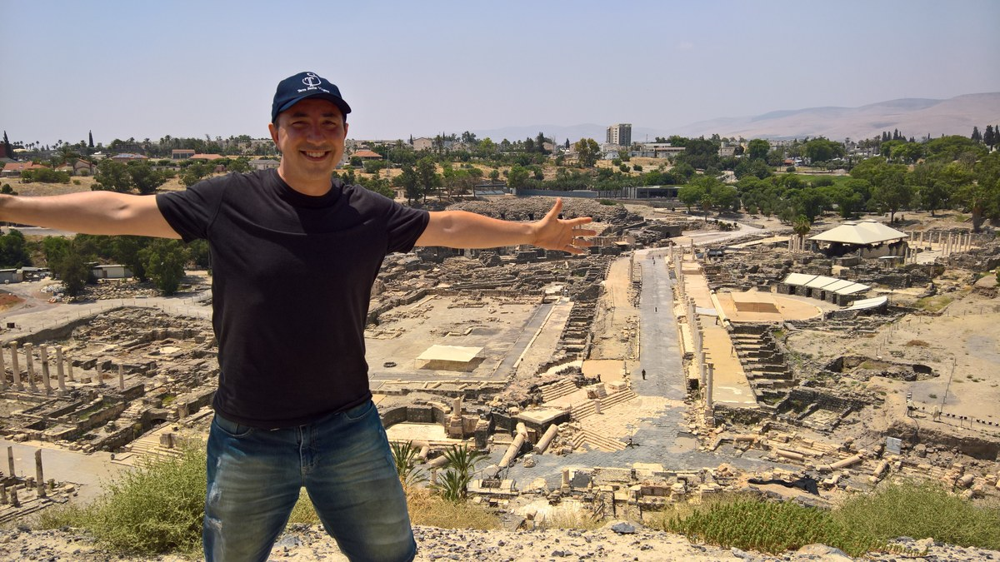

# מרקו אאורליו אלואיזה פיליו (Marco Aurélio Aloise Filho)

<!-- בורר שפות / Language Switcher -->

  <b>🌐 שפות / Languages:</b> 
  <a href="README.md">🇺🇸 English</a> &nbsp;|&nbsp;
  <a href="README.pt.md">🇧🇷 Português</a> &nbsp;|&nbsp;
  <a href="README.it.md">🇮🇹 Italiano</a> &nbsp;|&nbsp;
  <a href="README.es.md">🇪🇸 Español</a> &nbsp;|&nbsp;
  <b>🇮🇱 עברית</b>

<!-- תמונת פרופיל - בית שאן / ישראל -->

### מהנדס מערכות תוכנה &bull; חוקר בינה מלאכותית יישומית &bull; עשור של ניסיון בהוראה אקדמית

---

## 📌 אודותיי ורקע מקצועי

שלום וברוכים הבאים. שמי מרקו אלואיזה, מהנדס מערכות וחוקר בעל למעלה מ-20 שנות ניסיון בהנדסת תוכנה ומערכות עתירות ביצועים. הרקע האקדמי שלי כולל **MBA בהנדסת תוכנה מאוניברסיטת סאו פאולו (USP / Esalq)**, **התמחות בהנדסת תוכנה מאוניברסיטת קמפינס (UNICAMP)**, לימודי **תעודה בארכיטקטורת תוכנה, רכיבים ו-SOA מ-UNICAMP**, ותואר ראשון במחשבים וניהול עסקי (FATEC-ZL).

בעבודתי המקצועית אני מכהן כאנליסט מערכות בכיר ב-CRCSP, שם הגיתי ויישמתי מערך בינה מלאכותית לתמיכה בניתוח תהליכים רגולטוריים ומשפטיים — לרבות רשתות נוירונים עמוקות (MLP), ארכיטקטורת Transformer לחיזוי תוצאות תיקים וחישוב ענישה, ושימוש במודל שפה מקומי (**Gemma**) באמצעות LlamaSharp. במקביל, צברתי עשור של ניסיון בהוראה אקדמית באוניברסיטת מוג'י דאס קרוזס (UMC, 2011–2022), שם לימדתי קורסי ליבה במדעי המחשב (אלגוריתמים, מבני נתונים, הנדסת תוכנה ותכנות מונחה עצמים), הנחיתי עבודות גמר ושימשתי כחבר בוועדות בחינה אקדמיות.

פרופיל GitHub זה מהווה היכרות אישית קצרה ומציג מבחר מפרויקטי התוכנה העצמאיים שפיתחתי.

---

## 🔬 תחומי מחקר עיקריים

המחקר שלי מתמקד בחיבור בין תיאוריה מדעי המחשב לאתגרים הנדסיים מוחשיים בעולם האמיתי:

* **בינה מלאכותית יישומית ולמידה עמוקה:** ארכיטקטורות נוירונים מודרניות (Transformers, GANs, LSTMs ו-MLPs) למידול סדרות עתיות מורכבות ויצירת נתונים סינתטיים (*data augmentation*) להתמודדות עם מאגרי מידע קטנים בתעשייה.
* **שילוב חומרה-תוכנה וטלמטריה תעשייתית (IoT):** קריאת נתונים רציפה בזמן אמת ממכונות וחיישנים בפרוטוקולים תעשייתיים (Modbus/TCP) והסקה מואצת בקצה החומרה (DirectML על גבי GPU ו-NPU).
* **הנדסת תוכנה והנדסה הפוכה (כלי CASE):** פיתוח מנועי ניתוח תחבירי (AST Parsers), ניתוח סטטי של קוד מקור ושחזור אוטומטי של דיאגרמות ארכיטקטורה מקוד בשפות שונות.
* **אלגוריתמים ומחשוב עתיר ביצועים:** הנדסה מחדש וייעול של אלגוריתמי דחיסה קלאסיים ומערכות עיבוד עבור ארכיטקטורות מודרניות של 64 סיביות ב-C++ ו-C#.

---

## 🏆 הישגים אקדמיים

* **מועמדות לתזה המצטיינת בתוכנית ה-MBA (אוניברסיטת סאו פאולו USP / Esalq, 2026):** עבודת גמר בנושא *"שימוש בלמידת מכונה לקורלציה בין משתני קליית קפה איכותי למאפיינים סנסוריים"*, שהוערכה בציון המרבי והומלצה לפרס על ידי המנחה פרופ' אליזה אנטולי וחבר ועדת הבחינה פרופ' דייגו רפאל אמנסיו (USP). תקציר מנהלים פורסם בכתב העת המדעי-יישומי *Revista E&S (Pecege)*: [Machine Learning בקלייה וניתוח סנסורי של קפה מיוחד](https://revistaes.com.br/resumo-executivo/machine-learning-na-torra-e-analise-sensorial-de-cafes-especiais).

---

## 💻 פרויקטי תוכנה מרכזיים

> *הערה:* כל פרויקטי התוכנה המרכזיים שלי מנוהלים במאגרים פרטיים עקב קניין רוחני ומחקר פעיל. פתחתי מאגרי סקירה פומביים (*overview*) הכוללים תיעוד ארכיטקטוני, מתודולוגיה ודוגמאות קוד. **גישה מלאה למאגרים הפרטיים תינתן על פי בקשה לצורך הערכה אקדמית וטכנית.**

<table>
  <tr>
    <td width="35%" align="center">
      
    </td>
    <td width="65%" valign="top">
      <h3>☕ <a href="https://github.com/mjcg12/venezia-overview">Venezia Project</a></h3>
      
<b>מחקר יישומי &bull; IoT תעשייתי &bull; למידת מכונה &bull; Data Augmentation</b>

      

        פלטפורמת טלמטריה תעשייתית מלאה הקוראת בזמן אמת נתונים תרמודינמיים מתהליך קליית קפה ומקשרת אותם לציונים סנסוריים לפי תקן SCA.
      

      <ul>
        <li><b>תקשורת בזמן אמת:</b> אינטגרציית חומרה-תוכנה באמצעות <code>Modbus/TCP</code> ישירות ממכונת הקלייה.</li>
        <li><b>ניתוח אשכולות:</b> אלגוריתם <code>DBSCAN</code> לסיווג פרופילי קלייה.</li>
        <li><b>נתונים סינתטיים:</b> רשתות גנרטיביות (<code>GANs</code>) להרחבת מערכי נתונים דלילים.</li>
      </ul>
      

        
        
        
        
        
      

      
👉 <b>מאגר סקירה:</b> <a href="https://github.com/mjcg12/venezia-overview">github.com/mjcg12/venezia-overview</a>

    </td>
  </tr>

  <tr>
    <td width="35%" align="center">
      
    </td>
    <td width="65%" valign="top">
      <h3>🧠 Archimede</h3>
      
<b>תשתית למידה עמוקה &bull; האצת חומרה &bull; אימון והסקה</b>

      

        תשתית Deep Learning עצמאית שנכתבה ב-C# מאפס לאימון והסקה של רשתות נוירונים עמוקות, תוך ניצול ישיר של האצת חומרה גרפית בסביבת Windows.
      

      <ul>
        <li><b>האצת חומרה מגוונת:</b> ביצועים מהירים על מעבד (CPU), והאצה ייעודית על גבי GPU ו-NPU באמצעות <code>DirectML</code>.</li>
        <li><b>טופולוגיות נתמכות:</b> רשתות רב-שכבתיות (<code>MLP</code>), רשתות זיכרון (<code>LSTM</code>), מודלים גנרטיביים (<code>GANs</code>) ושכבות תשומת לב (<code>Transformers</code>).</li>
      </ul>
      

        
        
        
        
      

      
<i>🔗 מאגר סקירה בהכנה (קוד המקור הפרטי זמין לפי בקשה)</i>

    </td>
  </tr>

  <tr>
    <td width="35%" align="center">
      
    </td>
    <td width="65%" valign="top">
      <h3>📐 Prancheta UML</h3>
      
<b>הנדסת תוכנה &bull; כלי CASE &bull; הנדסה הפוכה רב-לשונית</b>

      

        סביבת מידול CASE ודיאגרמות UML שפותחה ב-C++ טבעי (MFC), המצוידת במנוע ניתוח לקסיקלי ותחבירי לשחזור ארכיטקטורות מקוד מקור.
      

      <ul>
        <li><b>הנדסה הפוכה אוטומטית:</b> מנתח תחבירי המשחזר דיאגרמות מחלקות וקשרי ירושה מקוד בשפות <b>C++, C#, Java, Python, Object Pascal ו-Visual Basic</b>.</li>
        <li><b>ביצועים טבעיים:</b> פעולה מהירה וקלת-משקל ללא עומס של סביבות ריצה וירטואליות.</li>
      </ul>
      

        
        
        
        
      

      
<i>🔗 מאגר סקירה בהכנה (קוד המקור הפרטי זמין לפי בקשה)</i>

    </td>
  </tr>

  <tr>
    <td width="35%" align="center">
      
    </td>
    <td width="65%" valign="top">
      <h3>🗜️ MArj</h3>
      
<b>אלגוריתמים עתירי ביצועים &bull; דחיסת נתונים &bull; C++ מודרני ב-64 סיביות</b>

      

        שחזור ומודרניזציה מלאה של אלגוריתם הדחיסה הקלאסי ARJ (שנכתב במקור ב-C ובאסמבלי) להתאמה לתקני C++ מודרניים של 64 סיביות.
      

      <ul>
        <li><b>אופטימיזציה ברמת המכונה:</b> מבני נתונים המיושרים לארכיטקטורות x86_64, תוך סילוק צווארי בקבוק ישנים של חלוקת זיכרון במקטעים.</li>
        <li><b>ממשק כפול:</b> כלי שורת פקודה (CLI) עתיר ביצועים וממשק משתמש גרפי (GUI) מקורי ל-Windows.</li>
      </ul>
      

        
        
        
      

      
<i>🔗 מאגר סקירה בהכנה (קוד המקור הפרטי זמין לפי בקשה)</i>

    </td>
  </tr>
</table>

---

## 🏛️ ניסיון בתעשייה

* **Conselho Regional de Contabilidade do Estado de São Paulo (CRCSP)** &bull; *אנליסט מערכות בכיר (2007 &ndash; הווה)*
  * **מערך AI לתמיכה בניתוח תהליכים:** הגיתי ויישמתי מערכות למידת מכונה לסיוע בניתוח תהליכי ביקורת ותיקים: רשתות MLP לסיווג מסמכים, מודלים מבוססי Transformer לחיזוי תוצאות וחישוב ענישה, ושימוש במודל שפה מקומי (**Gemma**) באמצעות LlamaSharp.
  * **מודרניזציה של מערכות ליבה:** הגיתי ויישמתי דיגיטציה מלאה של תיקי ביקורת (2010), מערכת תכתובת דיגיטלית חתומה ומאובטחת (2012) ופלטפורמות מובייל.

---

## 🎓 השכלה וניסיון אקדמי

* **MBA בהנדסת תוכנה:** אוניברסיטת סאו פאולו (USP / Esalq) &bull; *2024 &ndash; 2026*
* **לימודי תעודה מתקדמים (Extension) בארכיטקטורת תוכנה, רכיבים ו-SOA:** אוניברסיטת קמפינס (UNICAMP) &bull; *2008*
* **התמחות בהנדסת תוכנה:** אוניברסיטת קמפינס (UNICAMP) &bull; *2007*
* **תואר ראשון בטכנולוגיית מידע וניהול עסקי:** FATEC Zona Leste &bull; *2003 &ndash; 2006*
* **סגל אקדמי בהוראה גבוהה:** אוניברסיטת מוג'י דאס קרוזס (UMC) &bull; *מרצה (2011 &ndash; 2022)*
  * הוראת קורסי ליבה: ארכיטקטורת תוכנה, ניתוח ועיצוב מונחה עצמים, שיטות תכנות, אלגוריתמים ומסדי נתונים. הנחיית עבודות גמר ושיפוט בוועדות בחינה.

---

## 📬 יצירת קשר

- 📍 סאו פאולו, ברזיל
- ✉️ דוא"ל: [mjcg12@yahoo.com.br](mailto:mjcg12@yahoo.com.br)
- 📄 קורות חיים אקדמיים (Lattes): [6178513390905074](http://lattes.cnpq.br/6178513390905074)

  נבנה במסירות למדע, מחקר ומצוינות בהנדסת תוכנה.

