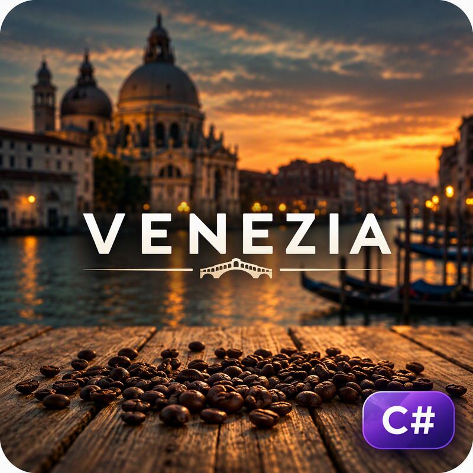
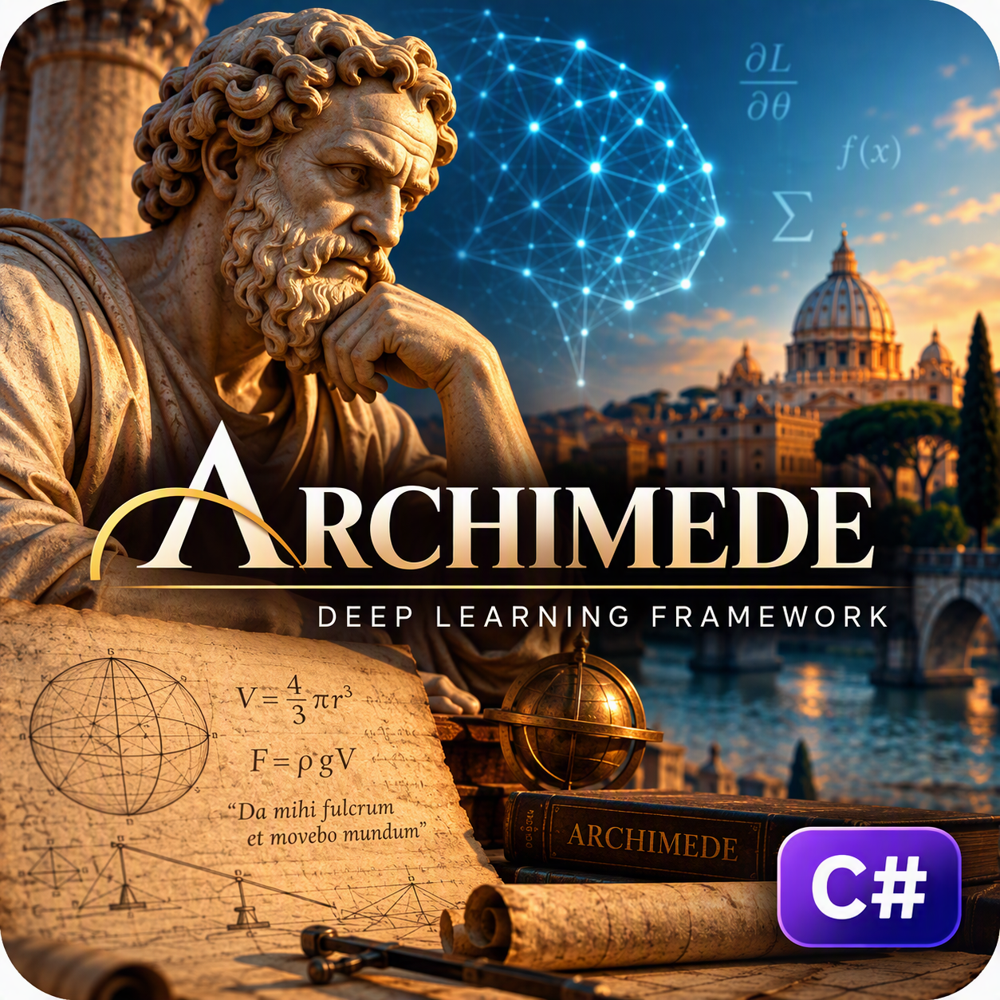
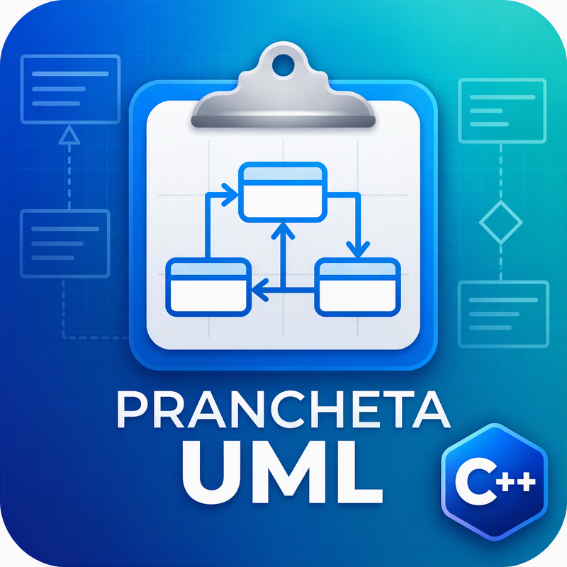
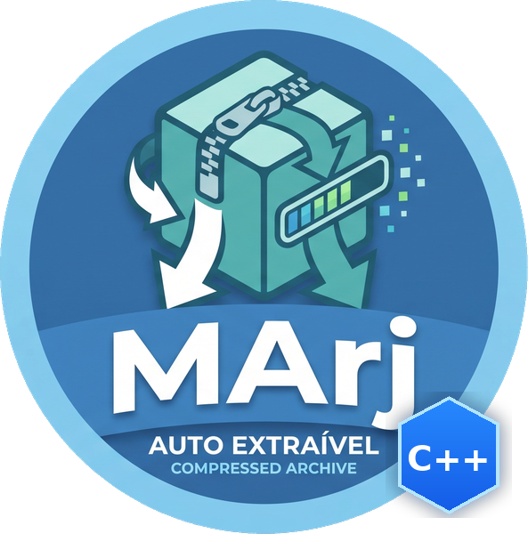

# Marco Aurélio Aloise Filho

<!-- Seletor de Idiomas / Language Switcher -->

  <b>🌐 Idiomas / Languages:</b> 
  <a href="README.md">🇺🇸 English</a> &nbsp;|&nbsp;
  <b>🇧🇷 Português</b> &nbsp;|&nbsp;
  <a href="README.it.md">🇮🇹 Italiano</a> &nbsp;|&nbsp;
  <a href="README.es.md">🇪🇸 Español</a> &nbsp;|&nbsp;
  <a href="README.he.md">🇮🇱 עברית</a>

<!-- Foto de Perfil - Versão Brasil -->

### Engenheiro de Software &bull; Pesquisador em Inteligência Artificial &bull; Experiência de uma década atuando na docência

---

## 📌 Sobre Mim & Trajetória

Sou graduado em Informática (FATEC-ZL) com uma caminhada de mais de 20 anos na área de tecnologia, unindo a prática diária de desenvolvimento de sistemas com a pesquisa e a vida acadêmica. Tenho **MBA em Engenharia de Software pela USP (Esalq)**, **Especialização em Engenharia de Software pela UNICAMP** e curso de **Extensão em Arquitetura de Software, Componentização e SOA também pela UNICAMP**.

Trabalho como Analista de Sistemas Sênior no CRCSP, onde idealizei e implementei soluções institucionais de apoio à análise de processos com Inteligência Artificial — aplicando redes neurais, arquitetura Transformer para predição processual e modelos de linguagem locais (como Gemma via LlamaSharp). No meio universitário, atuei por mais de dez anos como professor na Universidade de Mogi das Cruzes (UMC), lecionando disciplinas da base da computação (como Algoritmos, Programação Orientada a Objetos e Arquitetura de Software), participando de bancas avaliadoras e atuando em orientação de TCCs.

Este perfil no GitHub é uma breve apresentação pessoal e de alguns dos meus projetos autorais.

---

## 🔬 Interesses de Pesquisa

Gosto de investigar problemas em que a teoria computacional encontra desafios práticos do mundo real:

* **Inteligência Artificial Aplicada & Redes Neurais:** Estudo e aplicação de modelos profundos (Transformers, GANs, LSTMs e MLPs) para análise preditiva, aprendizado com dados complexos e geração de dados sintéticos (*data augmentation*) para enriquecer bases pequenas.
* **Integração Hardware-Software & IoT:** Coleta de dados e telemetria em tempo real direto de maquinários e sensores via protocolos industriais (como Modbus/TCP), unindo chão de fábrica e modelos inteligentes acelerados em hardware (GPU/NPU via DirectML).
* **Engenharia de Software & Engenharia Reversa:** Ferramental CASE, análise estática de código-fonte, construção de analisadores sintáticos (parsers/AST) e reconstrução automatizada de arquiteturas em múltiplas linguagens.
* **Algoritmos & Computação de Alto Desempenho:** Modernização de algoritmos clássicos de compressão e processamento de dados para arquiteturas modernas de 64 bits em C++ e C#.

---

## 🏆 Distinções Acadêmicas

* **Indicação a Melhor TCC do MBA USP/Esalq (2026):** Trabalho de Conclusão intitulado *"Uso de Machine Learning para correlacionar variáveis da torra de cafés especiais com notas sensoriais"*, aprovado com nota máxima e indicado ao prêmio pelos professores Elisa Antolli (orientadora) e Diego Raphael Amancio (banca USP). O resumo executivo da pesquisa foi publicado na *Revista E&S (Pecege)* e pode ser conferido em: [Machine Learning na torra e análise sensorial de cafés especiais](https://revistaes.com.br/resumo-executivo/machine-learning-na-torra-e-analise-sensorial-de-cafes-especiais).

---

## 💻 Grandes Projetos de Software

> *Nota:* Todos os meus projetos principais são mantidos em repositórios privados por se tratarem de pesquisas autorais e código proprietário. Criei repositórios públicos de apresentação (*overview*) com documentação, detalhes de arquitetura e exemplos de uso. **O acesso aos repositórios privados completos poderá ser concedido mediante solicitação.**

<table>
  <tr>
    <td width="35%" align="center">
      
    </td>
    <td width="65%" valign="top">
      <h3>☕ <a href="https://github.com/mjcg12/venezia-overview">Projeto Venezia</a></h3>
      
<b>Pesquisa Aplicada &bull; IoT &bull; Aprendizado de Máquina &bull; Data Augmentation</b>

      

        Sistema completo que captura em tempo real variáveis termodinâmicas da torra de cafés especiais e relaciona essas curvas com as notas sensoriais da prova da bebida (protocolo SCA).
      

      <ul>
        <li><b>Comunicação em Tempo Real:</b> Leitura de telemetria do torrador via protocolo industrial <code>Modbus/TCP</code>.</li>
        <li><b>Clusterização:</b> Agrupamento de perfis e variáveis com algoritmo <code>DBSCAN</code>.</li>
        <li><b>Dados Sintéticos:</b> Expansão de amostragem por Redes Adversariais Generativas (<code>GANs</code>).</li>
      </ul>
      

        
        
        
        
      

      
👉 <b>Repositório de Apresentação:</b> <a href="https://github.com/mjcg12/venezia-overview">github.com/mjcg12/venezia-overview</a>

    </td>
  </tr>

  <tr>
    <td width="35%" align="center">
      
    </td>
    <td width="65%" valign="top">
      <h3>🧠 Archimede</h3>
      
<b>Deep Learning Framework &bull; Aceleração por Hardware &bull; Treinamento e Inferência</b>

      

        Framework construído em C# do zero para treinamento e inferência de redes neurais profundas, tirando proveito direto dos recursos gráficos e aceleradores de hardware.
      

      <ul>
        <li><b>Aceleração em Hardware:</b> Execução eficiente em CPU e aceleração gráfica em GPU e NPU via <code>DirectML</code>.</li>
        <li><b>Topologias Suportadas:</b> Redes densas (<code>MLP</code>), recorrentes (<code>LSTM</code>), generativas (<code>GANs</code>) e blocos de atenção (<code>Transformers</code>).</li>
      </ul>
      

        
        
        
        
      

      
<i>🔗 Repositório de Apresentação em elaboração (código privado disponível sob solicitação)</i>

    </td>
  </tr>

  <tr>
    <td width="35%" align="center">
      
    </td>
    <td width="65%" valign="top">
      <h3>📐 Prancheta UML</h3>
      
<b>Engenharia de Software &bull; Modelagem Visual &bull; Engenharia Reversa Multilinguagem</b>

      

        Ambiente CASE de modelagem diagramática desenvolvido em C++ nativo (MFC), com um mecanismo de análise sintática e léxica voltado para extração e reconstrução de arquiteturas.
      

      <ul>
        <li><b>Engenharia Reversa Automatizada:</b> Parser capaz de reconstruir diagramas de classes e relações estruturais diretamente do código em <b>C++, C#, Java, Python, Object Pascal e Visual Basic</b>.</li>
        <li><b>Arquitetura Nativa:</b> Execução leve e veloz em ambiente Windows, sem dependência de runtimes pesados.</li>
      </ul>
      

        
        
        
        
      

      
<i>🔗 Repositório de Apresentação em elaboração (código privado disponível sob solicitação)</i>

    </td>
  </tr>

  <tr>
    <td width="35%" align="center">
      
    </td>
    <td width="65%" valign="top">
      <h3>🗜️ MArj</h3>
      
<b>Algoritmos de Alta Performance &bull; Compactação de Dados &bull; Modern C++</b>

      

        Reconstrução completa do clássico algoritmo de compactação ARJ (originalmente em C/Assembly) para padrões do C++ moderno otimizado para 64 bits.
      

      <ul>
        <li><b>Otimização de Baixo Nível:</b> Estruturas em memória alinhadas para arquiteturas x86_64, superando limitações e segmentações de memória do formato legado.</li>
        <li><b>Interface Flexível:</b> Disponível como utilitário de linha de comando (CLI) e aplicação com interface gráfica nativa para Windows.</li>
      </ul>
      

        
        
        
      

      
<i>🔗 Repositório de Apresentação em elaboração (código privado disponível sob solicitação)</i>

    </td>
  </tr>
</table>

---

## 🏛️ Atuação Profissional

* **Conselho Regional de Contabilidade do Estado de São Paulo (CRCSP)** &bull; *Analista de Sistemas Sênior (2007 &ndash; Atual)*
  * **IA de Apoio à Análise Processual:** Idealizou e implementou redes neurais MLP para triagem e classificação documental, arquiteturas Transformer (GPT) para previsão de desfechos e auxílio na dosimetria de penalidades, além de esteira de modelos de linguagem locais com **Gemma4** via LlamaSharp.
  * **Sistemas Corporativos Core:** Idealizou e implementou a digitalização dos processos de fiscalização (2010), sistema de ofícios digitais com assinatura ICP-Brasil (2012) e soluções móveis.

---

## 🎓 Formação Acadêmica & Docência

* **MBA em Engenharia de Software:** Universidade de São Paulo (USP / Esalq) &bull; *2024 &ndash; 2026*
* **Extensão Universitária em Arquitetura de Software, Componentização e SOA:** Universidade Estadual de Campinas (UNICAMP) &bull; *2008*
* **Especialização em Engenharia de Software:** Universidade Estadual de Campinas (UNICAMP) &bull; *2007*
* **Graduação em Informática (Gestão de Negócios):** FATEC Zona Leste &bull; *2003 &ndash; 2006*
* **Docência no Ensino Superior:** Universidade de Mogi das Cruzes (UMC) &bull; *Professor Universitário (2011 &ndash; 2022)*
  * Lecionou disciplinas de Engenharia de Software, Algoritmos, Estruturas de Dados e Orientação a Objetos. Atuou em orientação de TCCs e participação em bancas examinadoras.

---

## 📬 Contato

- 📍 São Paulo, SP &ndash; Brasil
- ✉️ Email: [mjcg12@yahoo.com.br](mailto:mjcg12@yahoo.com.br)
- 📄 Currículo Lattes: [6178513390905074](http://lattes.cnpq.br/6178513390905074)

  Desenvolvido com carinho e dedicação à ciência e à engenharia de software.

