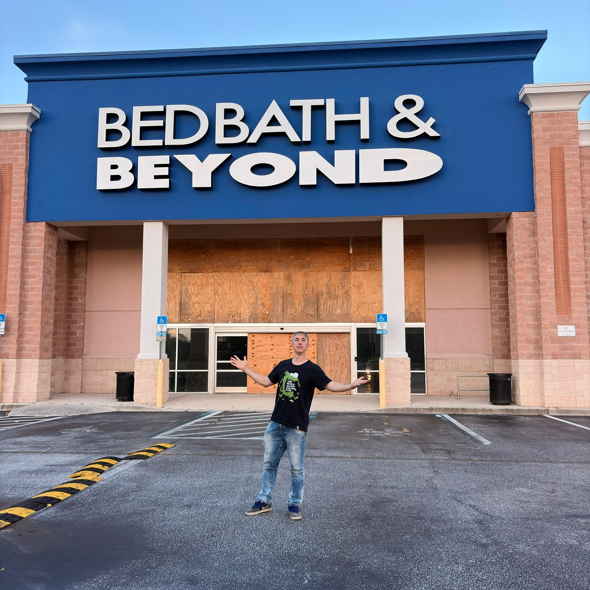

# Marco Aurélio Aloise Filho

<!-- Seletor de Idiomas / Language Switcher -->

  <b>🌐 Idiomas / Languages:</b> 
  <a href="README.md">🇺🇸 English (Main)</a> &nbsp;|&nbsp;
  <b>🇧🇷 Português</b> &nbsp;|&nbsp;
  <a href="README.it.md">🇮🇹 Italiano</a> <i>(em breve)</i> &nbsp;|&nbsp;
  <a href="README.es.md">🇪🇸 Español</a> <i>(em breve)</i>

<!-- Foto de Perfil - Versão Português (quando adicionar ProfilePT.jpg, substitua o arquivo na pasta Imgs/) -->

### Engenheiro de Software &bull; Pesquisador em Inteligência Artificial &bull; Ex-Professor Universitário

---

## 📌 Sobre Mim & Trajetória

Sou bacharel em Informática e especialista com **MBA em Engenharia de Software pela USP (Esalq)** e especializações em Engenharia de Software e Arquitetura/SOA pela **UNICAMP**. Possuo mais de duas décadas de atuação na intersecção entre engenharia de software de missão crítica, pesquisa em Inteligência Artificial aplicada e docência universitária.

Atualmente, atuo como **Analista de Sistemas Sênior no CRCSP**, onde idealizei e lidero a arquitetura do ecossistema institucional de inteligência artificial para automação e análise preditiva processual (redes neurais profundas, Transformers e LLMs locais). Entre 2011 e 2022, atuei como **Professor Universitário na Universidade de Mogi das Cruzes (UMC)**, ministrando disciplinas fundamentais de Ciência da Computação como Algoritmos, Análise e Projeto Orientados a Objetos e Arquitetura de Software, orientando 6 Trabalhos de Conclusão de Curso (TCC) e integrando diversas bancas examinadoras.

Este perfil no GitHub reúne meus projetos autorais, implementações de frameworks e investigações científicas com foco em processos seletivos de **Mestrado Acadêmico**.

---

## 🔬 Interesses de Pesquisa

Meus interesses científicos e tecnológicos concentram-se no desenvolvimento de sistemas inteligentes eficientes, com ênfase nas seguintes linhas:

* **Inteligência Artificial Aplicada & Redes Neurais Profundas:** Investigação de arquiteturas neurais avançadas (Transformers, GANs, LSTMs, MLPs) para modelagem de fenômenos complexos, enriquecimento de bases com dados sintéticos (*data augmentation*) e predições com interpretabilidade.
* **Integração Hardware-Software & Inteligência na Borda (IoT / Edge AI):** Aquisição contínua de telemetria industrial via protocolos de rede (ex.: Modbus/TCP), fusão sensorial e execução otimizada de modelos em hardware acelerado (GPU e NPU via DirectML).
* **Engenharia de Software & Inteligência de Código:** Modelagem avançada de sistemas (UML), técnicas de engenharia reversa de código-fonte multiplataforma, análise estática e extração de estruturas sintáticas abstratas (AST).
* **Computação de Alto Desempenho & Algoritmos de Sistemas:** Reimplementação e otimização de algoritmos clássicos de compactação e processamento de dados para arquiteturas modernas de 64 bits em C++ e C#.

---

## 🏆 Distinções & Publicações Recentes

* **Indicação a Melhor TCC do MBA USP/Esalq (2026):** Trabalho de Conclusão intitulado *"Uso de Machine Learning para correlacionar variáveis da torra de cafés especiais com notas sensoriais"*, aprovado com nota máxima e indicado à distinção pelos professores Elisa Antolli (orientadora) e Diego Raphael Amancio (banca examinadora USP).
* **Publicação em Periódico Técnico-Científico:** Resumo executivo publicado na *Revista E&S (Pecege)*: [Machine Learning na torra e análise sensorial de cafés especiais](https://revistaes.com.br/resumo-executivo/machine-learning-na-torra-e-analise-sensorial-de-cafes-especiais).

---

## 💻 Grandes Projetos de Software

> *Nota:* A maior parte dos projetos abaixo é mantida em repositórios privados devido a direitos proprietários e pesquisas em andamento. Para avaliação técnica e acadêmica, disponibilizo repositórios de apresentação (*overview*) detalhando arquitetura, metodologia e amostras de código.

<table>
  <tr>
    <td width="35%" align="center">
      
    </td>
    <td width="65%" valign="top">
      <h3>☕ <a href="https://github.com/mjcg12/venezia-overview">Projeto Venezia</a></h3>
      
<b>Pesquisa Aplicada &bull; IoT &bull; Aprendizado de Máquina &bull; Data Augmentation</b>

      

        Sistema completo de aquisição e processamento de telemetria termodinâmica de torra de cafés especiais com correlação a atributos sensoriais da bebida (SCA cupping).
      

      <ul>
        <li><b>Comunicação em Tempo Real:</b> Integração hardware-software com torrador via <code>Modbus/TCP</code>.</li>
        <li><b>Clusterização & Análise:</b> Agrupamentos multivariados com algoritmo <code>DBSCAN</code>.</li>
        <li><b>Dados Sintéticos:</b> Geração e balanceamento de amostras com Redes Adversariais Generativas (<code>GANs</code>).</li>
      </ul>
      

        
        
        
        
      

      
👉 <b>Repositório de Apresentação:</b> <a href="https://github.com/mjcg12/venezia-overview">github.com/mjcg12/venezia-overview</a>

    </td>
  </tr>

  <tr>
    <td width="35%" align="center">
      <!-- Imagem de Archimede ficará aqui: Imgs/Archimede.png -->
      

        🧠 ARCHIMEDE 
        <small style="color: #a6adc8;">Deep Learning Framework</small>  
        C# / DirectML
      

    </td>
    <td width="65%" valign="top">
      <h3>🧠 Archimede</h3>
      
<b>Deep Learning Framework &bull; Aceleração por Hardware &bull; Treinamento e Inferência</b>

      

        Framework proprietário desenvolvido em C# do zero para treinamento e inferência de redes neurais profundas. Projetado para máxima flexibilidade e integração direta com o subsistema gráfico do Windows.
      

      <ul>
        <li><b>Aceleração de Hardware:</b> Execução eficiente em CPU, e aceleração por GPU e NPU via <code>DirectML</code>.</li>
        <li><b>Arquiteturas Suportadas:</b> Camadas densas (<code>MLP</code>), recorrentes (<code>LSTM</code>), generativas (<code>GANs</code>) e modelos de atenção (<code>Transformers</code>).</li>
      </ul>
      

        
        
        
        
      

      
<i>🔗 Repositório de Apresentação em elaboração</i>

    </td>
  </tr>

  <tr>
    <td width="35%" align="center">
      <!-- Imagem de Prancheta UML ficará aqui: Imgs/PranchetaUML.png -->
      

        📐 PRANCHETA UML 
        <small style="color: #a6adc8;">Reverse Engineering & CASE</small>  
        C++ / MFC
      

    </td>
    <td width="65%" valign="top">
      <h3>📐 Prancheta UML</h3>
      
<b>Engenharia de Software &bull; Modelagem Visual &bull; Engenharia Reversa Multilinguagem</b>

      

        Ferramenta CASE de engenharia de software e modelagem diagramática desenvolvida em C++ (MFC), com mecanismo robusto de análise léxica e sintática para engenharia reversa.
      

      <ul>
        <li><b>Engenharia Reversa Automatizada:</b> Parser capaz de reconstruir diagramas de classes e dependências a partir do código-fonte em <b>C++, C#, Java, Python, Object Pascal e Visual Basic</b>.</li>
        <li><b>Arquitetura Nativa:</b> Execução de alto desempenho sem overhead de máquinas virtuais pesadas.</li>
      </ul>
      

        
        
        
        
      

      
<i>🔗 Repositório de Apresentação em elaboração</i>

    </td>
  </tr>

  <tr>
    <td width="35%" align="center">
      <!-- Imagem de MArj ficará aqui: Imgs/MArj.png -->
      

        🗜️ MArj 
        <small style="color: #a6adc8;">High-Performance Compression</small>  
        Modern C++ (64-bit)
      

    </td>
    <td width="65%" valign="top">
      <h3>🗜️ MArj</h3>
      
<b>Algoritmos de Alta Performance &bull; Compactação de Dados &bull; Modern C++</b>

      

        Reconstrução, refatoração e modernização do clássico algoritmo de compactação de dados ARJ original (escrito em C/Assembly legado) para o padrão moderno C++ de 64 bits.
      

      <ul>
        <li><b>Otimização de Baixo Nível:</b> Estruturas de dados alinhadas para arquiteturas modernas x86_64 e eliminação de gargalos legados de memória.</li>
        <li><b>Interfaces Duplas:</b> Disponibilização em interface de linha de comando (CLI) e interface gráfica nativa para Windows.</li>
      </ul>
      

        
        
        
      

      
<i>🔗 Repositório de Apresentação em elaboração</i>

    </td>
  </tr>
</table>

---

## 🏛️ Atuação Profissional em Sistemas Críticos

* **Conselho Regional de Contabilidade do Estado de São Paulo (CRCSP)** &bull; *Analista de Sistemas Sênior (2007 &ndash; Atual)*
  * **Ecossistema de IA Processual:** Concepção e implantação de rede neural MLP para triagem e classificação documental; integração de arquiteturas Transformer (GPT) para predição de desfechos de autos de infração e cálculo de dosimetria penal; pipeline de geração textual técnica com LLM local **Gemma4** via LlamaSharp.
  * **Sistemas Corporativos Core:** Responsável pela digitalização e tramitação 100% eletrônica dos processos fiscalizatórios (2010), sistema de ofícios digitais com certificação digital ICP-Brasil (2012) e soluções móveis institucionais.

---

## 🎓 Formação Acadêmica & Docência

* **MBA em Engenharia de Software:** Universidade de São Paulo (USP / Esalq) &bull; *2024 &ndash; 2026*
* **Extensão em Arquitetura de Software, Componentização e SOA:** Universidade Estadual de Campinas (UNICAMP) &bull; *2008*
* **Especialização em Engenharia de Software:** Universidade Estadual de Campinas (UNICAMP) &bull; *2007*
* **Tecnologia em Informática (Gestão de Negócios):** FATEC Zona Leste &bull; *2003 &ndash; 2006*
* **Magistério Superior:** Universidade de Mogi das Cruzes (UMC) &bull; *Professor Universitário (2011 &ndash; 2022)*
  * Docência em Engenharia de Software, Algoritmos, Estruturas de Dados e Orientação a Objetos. Orientador de 6 TCCs e membro ativo de bancas examinadoras.

---

## 📬 Contato Acadêmico & Profissional

- 📍 São Paulo, SP &ndash; Brasil
- ✉️ Email: [mjcg12@yahoo.com.br](mailto:mjcg12@yahoo.com.br)
- 📄 Currículo Lattes: [6178513390905074](http://lattes.cnpq.br/6178513390905074)
- 🌐 Perfil Institucional: [CRCSP](https://www.crcsp.org.br)

  Página desenvolvida para apresentação acadêmica e técnico-científica.

